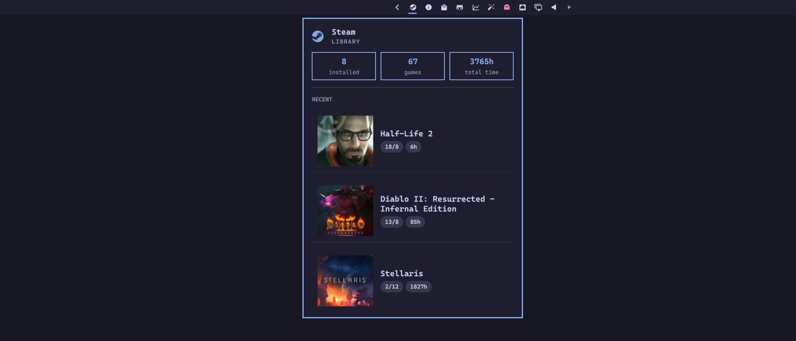

# Steam

Bar widget for Steam: installed vs owned games, lifetime playtime, and recent titles.



## Install

A plugin is a git repo with a `manifest.json` at its root. Adding one clones it into `~/.config/omarchy/plugins/evo.steam/`.

```bash
omarchy plugin add https://github.com/sebday/omarchy-plugin-steam.git
omarchy plugin enable evo.steam
```

A local path works the same way.

Plugins run as unsandboxed code inside `omarchy-shell`. Review the files before enabling.

## Requirements

- Steam installed, with a library under `~/.local/share/Steam` (override with `STEAM_DIR`)
- `steam` on `PATH` for launching games from the panel

Middle-click launches the Steam desktop shortcut the same way the programs menu does. Omarchy already floats that window via `default/hypr/apps/steam.lua` (centered, 1100×700).

Library counts, playtime, and recent titles are read from local Steam files by `bin/steam-status`. The owned-game count needs Steam's binary `appinfo.vdf` and `packageinfo.vdf` caches, which shell tools can't parse reliably, so that part is in Go. Everything else is plain text VDF and app manifests.

## Bar

| Click | Action |
|---|---|
| Left | Toggle the library panel |
| Middle | Open Steam |

The bar icon follows theme colours:

| State | Appearance |
|---|---|
| Playing a game | Pulse |
| Steam error | Urgent |
| Steam not running | Dimmed |
| Running, idle | Foreground |

Hover shows the current game, owned count, or that Steam is not running.

## Panel

Left-click the bar icon for a popup with:

- **Hero** — Steam, and Library or Not running
- **Stats** — installed games, owned games, and lifetime playtime
- **Status** — loading, error, not running, or the title currently playing
- **Recent** — up to three last-played games, with cover art, last played, and hours. Click a row to launch it.

The panel polls while it is open. Stats come from local files, not the Steam Web API.

## IPC

```bash
omarchy-shell shell toggle evo.steam '{}'
omarchy-shell evo.steam refresh
```

| Call | Action |
|---|---|
| `open` / `show` | Open the panel |
| `close` / `hide` | Close the panel |
| `toggle` | Toggle the panel |
| `refresh` | Refresh status |

## License

MIT.
